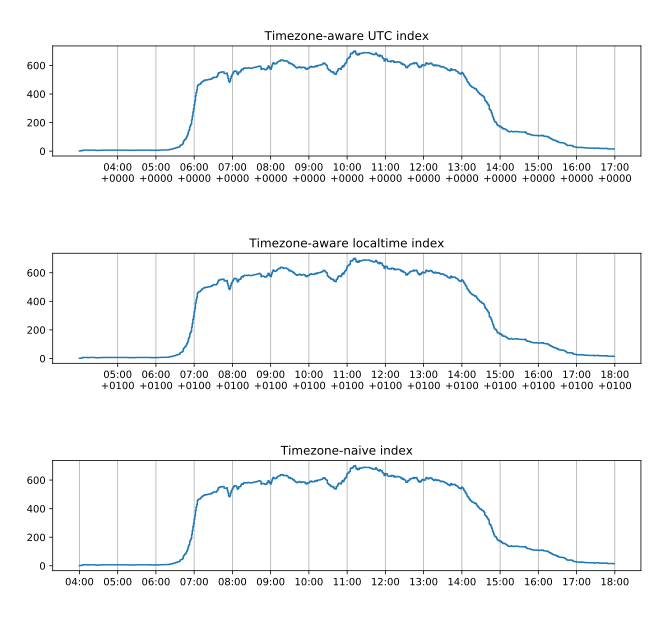

.. _timezones:

********************************
Converting to and from Timezones
********************************

The following code shows how to convert between localtime and UTC, query an sMAP server for data, and display the resulting time-series.

This examples shows occupancy data, which has dynamics in localtime.
I.e., people arrive on-site around seven in the morning, and leave around three in the afternoon.
Assuming the current timezone is Europe/Copenhagen, people arrive on-site around 06:00 UTC and leave around 14:00 UTC.
However, it can be useful to access the time-series with a localtime index, for instance for plotting, or for using the time-series with programs that do not support time-zones.

.. code-block:: python

    import logging
    from datetime import datetime, timedelta
    import asyncio

    import pytz

    from matplotlib import pyplot as plt
    import matplotlib.dates as mdates

    from cfei.smap import SmapAiohttpInterface

    async def main():
        hours = mdates.HourLocator(interval=1)

        smap = SmapAiohttpInterface("http://hostname:8079")

        # This is localtime naive, i.e., there is no information about timezone.
        timezone_naive_local_datetime = datetime(2018, 2, 6, 4)
        # 2018-02-06T04:00:00

        # This creates a timezone object to represent the desired timezone.
        timezone = pytz.timezone("Europe/Copenhagen")

        # This converts the timezone-naive datetime to a timezone-aware datetime.
        # This is still localtime, but it carries information about the timezone.
        timezone_aware_local_datetime = timezone.localize(timezone_naive_local_datetime)
        # 2018-02-06T04:00:00+01:00

        # This converts the localtime to UTC.
        # It is necessary because comparisons between datetimes with different
        # timezones is not supported in Python and pandas.
        timezone_aware_utc_datetime = timezone_aware_local_datetime.astimezone(pytz.UTC)
        # 2018-02-06T03:00:00Z

        # A UTC timezone-aware datetime can be used with this library.
        readings = await smap.fetch_readings_intertwined(
            timezone_aware_utc_datetime,
            timezone_aware_utc_datetime + timedelta(hours=14),
            "uuid = '12345678-1234-1234-1234-123412341234'",
        )

        # The resulting time-series have always their index in UTC.
        timezone_aware_utc_index = readings.index

        # Most time-series processing can be done in UTC, but sometimes it may
        # be necessary to convert it to localtime.
        # This is localtime but it still carries information about the timezone.
        timezone_aware_localtime_index = timezone_aware_utc_index.tz_convert(timezone)

        # And occasionally it may be necessary to drop the timezone information
        # entirely.
        # These situations are critical and must be carefully handled.

        # First the index is converted to localtime, and then its timezone is set
        # to None.
        timezone_naive_localtime_index = timezone_aware_localtime_index.tz_localize(None)

        figure, axes = plt.subplots(nrows=3)

        axes[0].set_title("Timezone-aware UTC index")
        axes[0].step(timezone_aware_utc_index, readings.values)
        axes[0].xaxis.set_major_locator(hours)
        axes[0].xaxis.set_major_formatter(
            mdates.DateFormatter("%H:%M\n%z", tz=timezone_aware_utc_index.tz)
        )
        axes[0].xaxis.grid()

        axes[1].set_title("Timezone-aware localtime index")
        axes[1].step(timezone_aware_localtime_index, readings.values)
        axes[1].xaxis.set_major_locator(hours)
        axes[1].xaxis.set_major_formatter(
            mdates.DateFormatter("%H:%M\n%z", tz=timezone_aware_localtime_index.tz)
        )
        axes[1].xaxis.grid()

        axes[2].set_title("Timezone-naive index")
        axes[2].step(timezone_naive_localtime_index, readings.values)
        axes[2].xaxis.set_major_locator(hours)
        axes[2].xaxis.set_major_formatter(mdates.DateFormatter("%H:%M\n%z"))
        axes[2].xaxis.grid()

        figure.tight_layout()

        plt.show()

    if __name__ == '__main__':
        logging.basicConfig(level=logging.INFO)
        loop = asyncio.get_event_loop()
        try:
            loop.run_until_complete(main())
        finally:
            loop.close()

The generated plot is shown in :numref:`label`.
The first time-series is rising at 06:00+0000, and the second one is rising at 07:00+0100, which are indeed the same instant in two different timezones.
The third time-series is instead rising at 07:00, which is ambiguous.
However, this time-series can be processed by other programs that do not support timezones.
It is responsibility of the user to properly manage the timezone information for the rest of the pipeline.

.. _label:

   The same time-series with three different indices: one in UTC, one in the local timezone, and one without timezone
